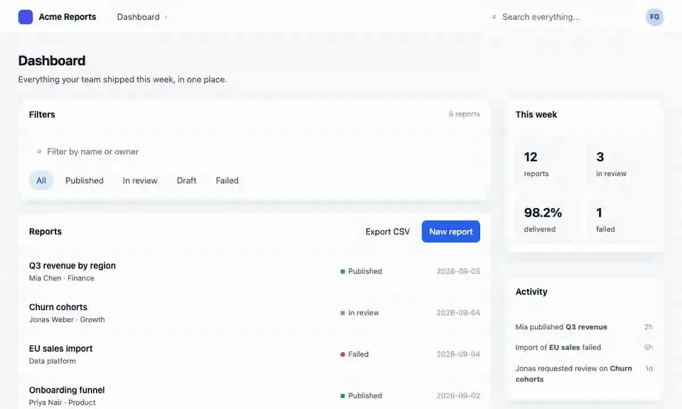

# Redlining

Redlining, in the proofreader's sense: mark up your **running** Next.js app the way you would mark up a proof, and hand Claude Code a spec that names the exact file, line, host element and React owner chain for every note. No guessing which component "the form on the right" is.

```sh
pnpm add -D redlining && npx redlining init
```

```ts
// next.config.ts
import { withRedlining } from 'redlining/next'
export default withRedlining({/* your config */})
```

```tsx
// app/layout.tsx
import { Redlining } from 'redlining'
export default function RootLayout({ children }) {
  return (
    <html>
      <body>
        {children}
        <Redlining />
      </body>
    </html>
  )
}
```



Press **Alt+R** in the running app. Click an element or drag a box, write a note, and press **Save**. Then, in Claude Code:

```
/redline
```

Claude Code reads `.redlining/annotations.md`, which looks like this:

```md
# Redlining — /dashboard (2026-09-06 14:12 · viewport 1440×900)

## 1 · CHANGE — MainNav

- Anchor: `<nav>` · app/(app)/layout.tsx:42 · owners: RootLayout › Header › MainNav
- Text: "Dashboard · Reports · Settings"
- Note: Replace the dropdown with a horizontal top nav. Same items, same order.
  Active item underlined.

## 2 · ADD — inside FilterPanel

- Container: `<section>` · app/(app)/dashboard/page.tsx:87 · owners: DashboardPage › FilterPanel
- Position: after child 2 · full width · ≈ 220 px tall
- Note: Sortable table. Columns: Name, Status, Updated. Status filter chips above it.
  Reuse our existing DataTable if present.

## 3 · REMOVE — "Export CSV" button

- Anchor: `<button>` · components/toolbar.tsx:31 · owners: DashboardPage › Toolbar
- Text: "Export CSV"
- Note: Remove; the action moves into the new table's row menu.

---

Apply in order. Reuse existing components and design tokens. Do not touch anything not listed.
```

Redlining never edits code. Claude Code stays the only thing that changes your codebase. The session lives in `localStorage` per route until you clear it, so you can re-send with tweaks after a `/redline` run.

## Set up with an agent

Prefer to have Claude Code do the setup? Paste the prompt from the docs' [Set up with an agent](site/getting-started.html#agent) section (copy button included; published with the site). It installs, wires, initialises and verifies Redlining in the current repository and reports back without committing.

## How it works

- In development, a loader registered by `withRedlining()` stamps every host element (`<nav>`, `<button>`, not components) with `data-rl="<file>:<line>:<col>"`. Server Components get it for free: the attribute is static markup.
- The overlay reads that attribute on click and walks React's owner chain for the component names.
- Draw mode resolves the container under your rectangle and records where in it the new thing goes.
- Nothing runs in production: the loader is registered only for the dev server, and the package's `production` export is a component that returns `null`.

## Overlay

| Key                       | Action                                                                           |
| ------------------------- | -------------------------------------------------------------------------------- |
| `Alt+R`                   | Toggle the overlay (`hotkey` option)                                             |
| `S` / `D` / `M`           | Select / Draw / Move mode                                                        |
| `[` / `]` or `⌥` + scroll | Walk the selection up / down the ancestor chain                                  |
| `⇧` + click               | Add another element to the open note (one note, several anchors)                 |
| `L`                       | Annotation list                                                                  |
| `⌘⇧C`                     | Copy the prompt to the clipboard                                                 |
| `⌘⏎`                      | Save to `.redlining/` (with a pinned screenshot unless the camera toggle is off) |
| `Esc`                     | Close popover → panel → overlay                                                  |

## Options

```tsx
<Redlining
  endpoint="/api/redlining" // where Save posts
  hotkey="Alt+R"
  position="bottom-right" // Next DevTools sits bottom-left
  theme="light" // or "dark"
  maxAnnotations={15} // a warning shows at 10
  screenshot // include screenshot.png with burned-in pins
/>
```

```ts
withRedlining(config, {
  include: ['app', 'components', 'src'], // directories whose .tsx/.jsx get anchors
})
```

### Vite

```ts
// vite.config.ts
import { redlining } from 'redlining/vite'
export default defineConfig({ plugins: [redlining(), react()] })
```

Mount `<Redlining />` in your root component. The plugin runs only under `vite dev`; `include` defaults to `['src']`. There is no route handler outside Next.js yet, so use **Copy prompt** rather than Save.

The route handler can be configured too:

```ts
// app/api/redlining/route.ts
import { createHandler } from 'redlining/next/route'
export const POST = createHandler({ outDir: '.redlining', maxBytes: 8 * 1024 * 1024 })
```

## Support

| Setup                                         | Status                               | Precision                            |
| --------------------------------------------- | ------------------------------------ | ------------------------------------ |
| Next.js 16+, Turbopack or webpack, App Router | Supported                            | file:line + owner chain              |
| Vite + React (`redlining/vite`)               | Supported                            | file:line + owner chain              |
| Any React app without the loader              | Reduced: mount `<Redlining />` alone | owner chain + selector, no file:line |
| Non-React frameworks                          | Not supported                        | —                                    |

`stripRedlining(html)` removes `data-rl` attributes from dev-rendered HTML for snapshot tests.

## Docs

Getting started, the guide, the annotation-format reference and help: [`site/`](site/), published at https://frankgoeltl.github.io/26-redlining/ once GitHub Pages is enabled for the repository (Settings → Pages → Source: GitHub Actions).

## Status

Pre-release, `0.0.x`. The annotation file format is unstable until the next minor; the design is in [docs/redlining-prd.md](docs/redlining-prd.md).

MIT.
