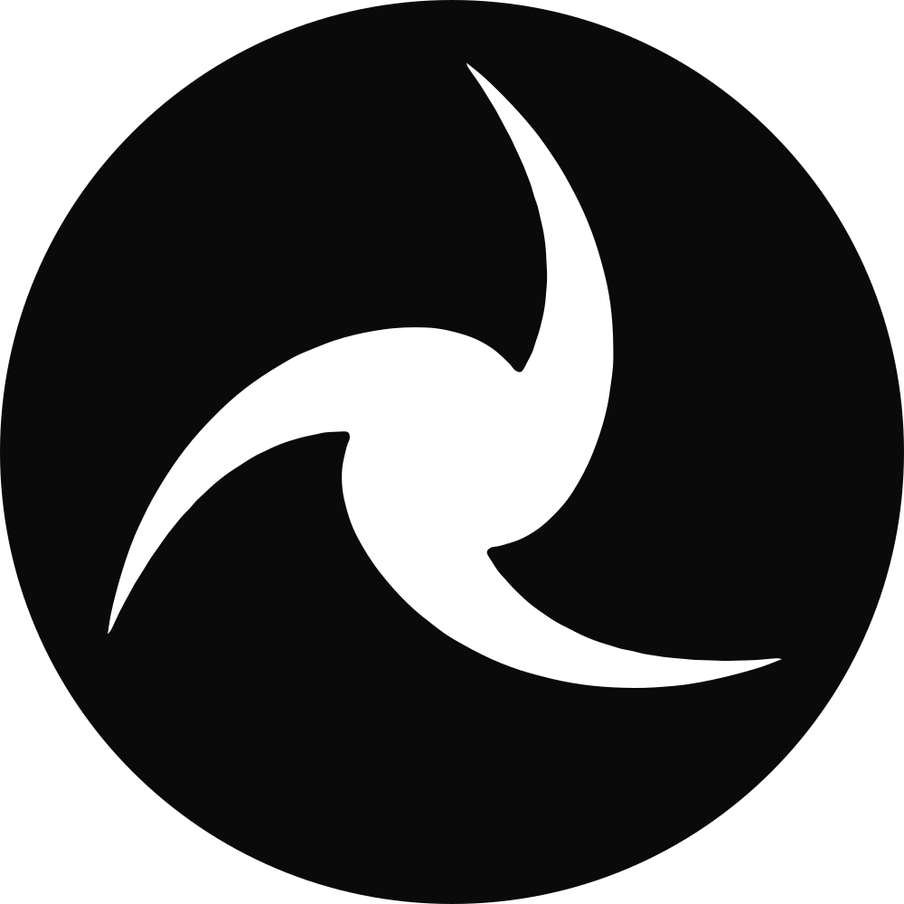

<p align="center">
  
</p>

<h1 align="center">redlining</h1>

<p align="center">Mark up the running app. Hand your coding agent the exact file and line.</p>

Redlining, in the proofreader's sense: mark up your **running** app the way you would mark up a proof, and hand your coding agent (Claude Code first, any other through the same file) a spec that names the exact file, line, host element and component owner chain for every note (built for Next.js; works on any page). No guessing which component "the form on the right" is.

```sh
npm i -D redlining && npx redlining init     # or pnpm add -D / yarn add -D / bun add -d: whatever your lockfile says
```

```ts
// next.config.ts
import { withRedlining } from 'redlining/next'
export default withRedlining({/* your config */})
```

```tsx
// app/layout.tsx
import { Redlining } from 'redlining'
export default function RootLayout({ children }) {
  return (
    <html>
      <body>
        {children}
        <Redlining />
      </body>
    </html>
  )
}
```


Press **Alt+R** in the running app. Click an element or drag a box, write a note, and press **Save**. Then, in Claude Code (any other agent reads the same file or the copied prompt):

```
/redline
```

The agent reads `.redlining/annotations.md`, which looks like this:

```md
# Redlining — /dashboard (2026-09-06 14:12 · viewport 1440×900)

## 1 · CHANGE — MainNav

- Anchor: `<nav>` · app/(app)/layout.tsx:42 · owners: RootLayout › Header › MainNav
- Text: "Dashboard · Reports · Settings"
- Note: Replace the dropdown with a horizontal top nav. Same items, same order.
  Active item underlined.

## 2 · ADD — inside FilterPanel

- Container: `<section>` · app/(app)/dashboard/page.tsx:87 · owners: DashboardPage › FilterPanel
- Position: after child 2 · full width · ≈ 220 px tall
- Note: Sortable table. Columns: Name, Status, Updated. Status filter chips above it.
  Reuse our existing DataTable if present.

## 3 · REMOVE — "Export CSV" button

- Anchor: `<button>` · components/toolbar.tsx:31 · owners: DashboardPage › Toolbar
- Text: "Export CSV"
- Note: Remove; the action moves into the new table's row menu.

---

Apply in order. Reuse existing components and design tokens. Do not touch anything not listed.
```

Redlining never edits code. Your agent stays the only thing that changes your codebase. Tweak mode previews changes in the browser and exports the numbers with their provenance (`font-size: 14px → 16px (class text-sm → text-base)`, `width: auto (96px, laid out by the parent grid) → 128px — … prefer changing the layout`) beside the element's classes, never inline styles. The session lives in `localStorage` per route until you clear it, so you can re-send with tweaks after a `/redline` run.

## Set up with an agent

Prefer to have an agent do the setup? Paste the prompt from the docs' [Set up with an agent](site/getting-started.html#agent) section (copy button included; published with the site). It installs, wires, initialises and verifies Redlining in the current repository and reports back without committing.

## Works with

| Stack                      | Anchors                           | Component names            | Save                                                           |
| -------------------------- | --------------------------------- | -------------------------- | -------------------------------------------------------------- |
| Next.js 16+ (App Router)   | `file:line` via `withRedlining()` | React owner chain          | route handler (`redlining init`)                               |
| Vite + React               | `file:line` via `redlining/vite`  | React owner chain          | `redlining({ endpoint: true })` on the dev server, or download |
| Angular (dev mode)         | selector + text                   | component classes via `ng` | download, or your own endpoint                                 |
| Any page (vanilla, Vue, …) | selector + text                   | Vue instance names         | download                                                       |

Everything DOM-based works everywhere: select, draw, move, tweak with provenance and class hints, notes, references, Markdown export. Outside a React toolchain, load the bundled overlay from a script tag (React included, dev only):

```html
<script
  type="module"
  src="/node_modules/redlining/dist/standalone.js"
  data-redlining
  data-endpoint="off"
></script>
```

or call it: `import { mount } from 'redlining/standalone'; mount({ endpoint: false })`. With `endpoint: false` (or when no endpoint answers) Save downloads `annotations.md`, `annotations.json` and the images; move them into `.redlining/` and run `/redline`. HTML templates are not stamped yet, so those anchors are selector-only. On a site served as plain files, copy `dist/standalone.js` next to the pages and point `src` at it; there is no dev/prod switch on such a site, so remove the tag and the copy before you deploy. The difference in the export:

```
- Anchor: `<button>` · components/toolbar.tsx:10 · owners: DashboardPage › Toolbar   # with the loader
- Anchor: `<h1>` · unresolved — locate by selector `#title` and text                # without
```

## How it works

- In development, a loader registered by `withRedlining()` stamps every host element (`<nav>`, `<button>`, not components) with `data-rl="<file>:<line>:<col>"`. Server Components get it for free: the attribute is static markup.
- The overlay reads that attribute on click and walks React's owner chain for the component names.
- Draw mode resolves the container under your rectangle and records where in it the new thing goes.
- Nothing runs in production: the loader is registered only for the dev server, and the package's `production` export is a component that returns `null`.

## Overlay

| Key                                               | Action                                                                                           |
| ------------------------------------------------- | ------------------------------------------------------------------------------------------------ |
| `Alt+R`                                           | Toggle the overlay (`hotkey` option)                                                             |
| `S` / `D` / `M` / `T`                             | Select / Draw / Move / Tweak mode                                                                |
| `[` / `]` or `⌥` + scroll                         | Walk the selection up / down the ancestor chain                                                  |
| `⇧` + click                                       | Add another element to the open note (one note, several anchors)                                 |
| `L`                                               | Annotation list                                                                                  |
| Tweak: handles, `⌥` drag, arrows, `⌘Z`, `⌥` hover | Resize, spacing, nudge, undo, measure; the export lists every change as before → after           |
| Width select (375 / 768 / 1280)                   | Open the page in a real narrow viewport (an iframe); annotations made inside carry `Applies at`  |
| Move button                                       | Cycle the toolbar through the four corners (remembered); Clear session sits in the list panel    |
| `⌘⇧C`                                             | Copy the prompt to the clipboard                                                                 |
| `⌘⏎`                                              | Save to `.redlining/` (with a pinned screenshot unless the camera toggle is off)                 |
| `?`                                               | In-package help: keys, the loop, links to the docs                                               |
| List panel copy icons                             | Copy the whole prompt, or one annotation as its own prompt                                       |
| List panel archive                                | Rows are archived, not deleted; the archive keeps route, note, changes and verdict, and restores |
| `Esc`                                             | Close popover → panel → overlay                                                                  |

## Options

```tsx
<Redlining
  endpoint="/api/redlining" // where Save posts; false downloads the files instead
  hotkey="Alt+R"
  position="bottom-right" // Next DevTools sits bottom-left
  theme="light" // or "dark"
  maxAnnotations={15} // a warning shows at 10
  screenshot // include screenshot.png with burned-in pins
  framework="tailwind4" // tailwind4 | tailwind3 | css-modules | css; detected when omitted
/>
```

```ts
withRedlining(config, {
  include: ['app', 'components', 'src'], // directories whose .tsx/.jsx get anchors
})
```

### Vite

```ts
// vite.config.ts
import { redlining } from 'redlining/vite'
export default defineConfig({ plugins: [redlining(), react()] })
```

Mount `<Redlining />` in your root component. The plugin runs only under `vite dev`; `include` defaults to `['src']`. Pass `redlining({ endpoint: true })` to serve the save endpoint from the dev server at `/api/redlining` (it writes to `.redlining/` and reads `reply.md` like the Next.js route; `outDir` and `maxBytes` are options); without it, Save downloads the files.

The route handler can be configured too:

```ts
// app/api/redlining/route.ts
import { createHandlers } from 'redlining/next/route'
export const { GET, POST } = createHandlers({ outDir: '.redlining', maxBytes: 16 * 1024 * 1024 })
```

## Support

| Setup                                                     | Status                                                           | Precision                            |
| --------------------------------------------------------- | ---------------------------------------------------------------- | ------------------------------------ |
| Next.js 16+, Turbopack or webpack, App Router             | Supported                                                        | file:line + owner chain              |
| Vite + React (`redlining/vite`)                           | Supported                                                        | file:line + owner chain              |
| Any React app without the loader                          | Supported: mount `<Redlining />` alone; Save downloads the files | owner chain + selector, no file:line |
| Angular (dev mode) via `redlining/standalone`             | Supported; Save downloads the files                              | component names + selector           |
| Vue, plain HTML, anything else via `redlining/standalone` | Supported; Save downloads the files                              | selector (+ Vue instance names)      |

`stripRedlining(html)` removes `data-rl` attributes from dev-rendered HTML for snapshot tests.

## Docs

Getting started, the guide, the annotation-format reference and help: [`site/`](site/), published at https://redlining.deep-thought.rocks (Vercel; DNS at Cloudflare). Source, issues and pull requests: https://github.com/deep-thought-rocks/26-redlining.

## Status

Pre-release, `0.x`. The annotation file format is unstable until the next minor; the design is in [docs/redlining-prd.md](docs/redlining-prd.md).

MIT.
